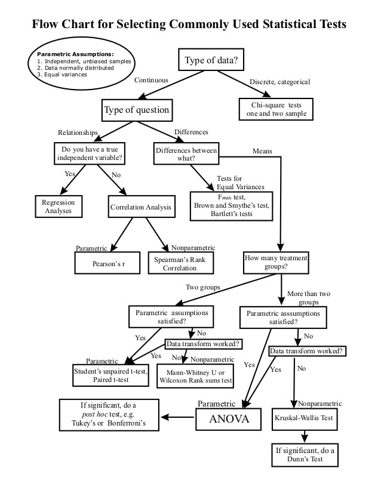

# Statistics with R

##### 3 workshops conducted on Statistical Analysis.

## Workshop 1: Hypothesis Testing.

- Forming Null and Alternate hypothesis.
- Null hypothesis significance testing.
- Testing for Normal Distribution.

## Workshop 2: Hypothesis Testing in action.

- Types of data
- Statistical Tests
- How to select the right test

## Workship 3: Statistical Modelling & Visualization.

- Linear Regression
- Linear Mixed Regression Models
- Boxplots, Histograms, Correlation graph, Mixed regression graph.

Workshop delivered by Arvin and Shubham
